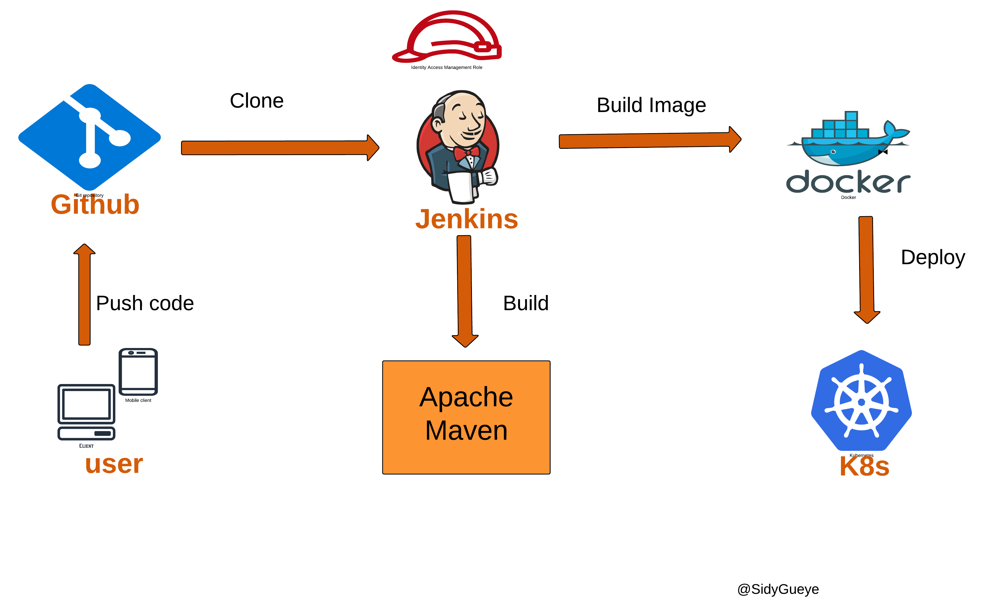

# ci pipeline with jenkins, maven docker & k8s
The goal of this project is to setting up a DevOps pipeline using jenkins, Docker and Kubernetes
Automate a software development workflow, containerize apps with Docker and efficiently deploy them to amazon EKS 
